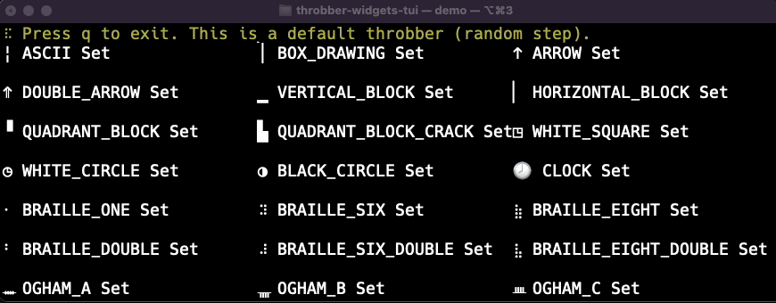

# Throbber widget of [ratatui]

[ratatui]: https://github.com/ratatui-org/ratatui
[tui-rs]: https://github.com/fdehau/tui-rs

> **_NOTE:_** If you want to use [tui-rs] instead of [ratatui], please use 0.4.1 or older version.

`throbber-widgets-tui` is a [ratatui] widget that displays throbber.

A throbber may also be called:

- activity indicator
- indeterminate progress bar
- loading icon
- spinner
- ぐるぐる(guru guru)

## Demo



The demo shown in the gif can be run with all available symbols.

```sh
cargo run --example demo --release
```

## Features

- Render throbber
- With label
- Random or specified step, also negative is possible.

## Getting Started

MSRV: `throbber-widgets-tui` requires rustc 1.74.0 or newer.

```sh
cargo add throbber-widgets-tui
```

Example code:

```rust
// :
// :
struct App {
    throbber_state: throbber_widgets_tui::ThrobberState,
}
impl App {
    fn on_tick(&mut self) {
        self.throbber_state.calc_next();
    }
}
// :
// :
fn ui(f: &mut ratatui::Frame, app: &mut App) {
    let chunks = ratatui::layout::Layout::default()
        .direction(ratatui::layout::Direction::Horizontal)
        .margin(1)
        .constraints(
            [
                ratatui::layout::Constraint::Percentage(50),
                ratatui::layout::Constraint::Percentage(50),
            ]
            .as_ref(),
        )
        .split(f.area());

    // Simple random step
    let simple = throbber_widgets_tui::Throbber::default();
    f.render_widget(simple, chunks[0]);

    // Set full with state
    let full = throbber_widgets_tui::Throbber::default()
        .label("Running...")
        .style(ratatui::style::Style::default().fg(ratatui::style::Color::Cyan))
        .throbber_style(ratatui::style::Style::default().fg(ratatui::style::Color::Red).add_modifier(ratatui::style::Modifier::BOLD))
        .throbber_set(throbber_widgets_tui::CLOCK)
        .use_type(throbber_widgets_tui::WhichUse::Spin);
    f.render_stateful_widget(full, chunks[1], &mut app.throbber_state);
}
```

## Apps using throbber-widgets-tui

- [mntime](https://github.com/arkbig/mntime): Execute "m" commands "n" times to calculate mean of usage time and memory.  As an alternative to "time", "gnu-time" is used internally.

## Dependencies (By default)

Direct dependencies crates:

```sh
cargo license --direct-deps-only --avoid-build-deps --avoid-dev-deps | awk -F ":" 'BEGIN {printf "|License|crate|\n|-|-|\n"} {printf "|%s|%s|\n", $1, $2}'
```

|License|crate|
|-|-|
|MIT (1)| ratatui|
|Zlib (1)| throbber-widgets-tui|

Chain dependencies crates:

```sh
cargo license --avoid-build-deps --avoid-dev-deps | awk -F ":" 'BEGIN {printf "|License|crate|\n|-|-|\n"} {printf "|%s|%s|\n", $1, $2}'
```

|License|crate|
|-|-|
|(Apache-2.0 OR MIT) AND Unicode-3.0 (1)| unicode-ident|
|Apache-2.0 OR Apache-2.0 WITH LLVM-exception OR MIT (3)| linux-raw-sys, rustix, wasi|
|Apache-2.0 OR BSL-1.0 (1)| ryu|
|Apache-2.0 OR MIT (49)| allocator-api2, bitflags, cassowary, cfg-if, either, equivalent, errno, fnv, hashbrown, heck, ident_case, indoc, itertools, itoa, libc, lock_api, log, parking_lot, parking_lot_core, paste, proc-macro2, quote, rustversion, scopeguard, signal-hook, signal-hook-mio, signal-hook-registry, smallvec, static_assertions, syn, unicode-segmentation, unicode-truncate, unicode-width, unicode-width, winapi, winapi-i686-pc-windows-gnu, winapi-x86_64-pc-windows-gnu, windows-link, windows-sys, windows-sys, windows-targets, windows_aarch64_gnullvm, windows_aarch64_msvc, windows_i686_gnu, windows_i686_gnullvm, windows_i686_msvc, windows_x86_64_gnu, windows_x86_64_gnullvm, windows_x86_64_msvc|
|MIT (15)| castaway, compact_str, crossterm, crossterm_winapi, darling, darling_core, darling_macro, instability, lru, mio, ratatui, redox_syscall, strsim, strum, strum_macros|
|Zlib (2)| foldhash, throbber-widgets-tui|

## License

This repository's license is zlib. Please feel free to use this, but no warranty.
