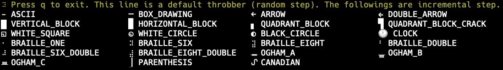

# Throbber widget of [ratatui]

[ratatui]: https://github.com/ratatui-org/ratatui
[tui-rs]: https://github.com/fdehau/tui-rs

> **_NOTE:_** If you want to use [tui-rs] instead of [ratatui], please use 0.4.1 or older version.

`throbber-widgets-tui` is a [ratatui] widget that displays throbber.

A throbber may also be called:

- activity indicator
- indeterminate progress bar
- loading icon
- spinner
- ぐるぐる(guru guru)

## Demo



The demo shown in the gif can be run with all available symbols.

```sh
cargo run --example demo --release
```

## Features

- Render throbber
- With label
- Random or specified step, also negative is possible.

## Getting Started

MSRV: `throbber-widgets-tui` requires rustc 1.86.0 or newer.

```sh
cargo add throbber-widgets-tui
```

Example code:

```rust
// :
// :
struct App {
    throbber_state: throbber_widgets_tui::ThrobberState,
}
impl App {
    fn on_tick(&mut self) {
        self.throbber_state.calc_next();
    }
}
// :
// :
fn ui(f: &mut ratatui::Frame, app: &mut App) {
    let chunks = ratatui::layout::Layout::default()
        .direction(ratatui::layout::Direction::Horizontal)
        .margin(1)
        .constraints(
            [
                ratatui::layout::Constraint::Percentage(50),
                ratatui::layout::Constraint::Percentage(50),
            ]
            .as_ref(),
        )
        .split(f.area());

    // Simple random step
    let simple = throbber_widgets_tui::Throbber::default();
    f.render_widget(simple, chunks[0]);

    // Set full with state
    let full = throbber_widgets_tui::Throbber::default()
        .label("Running...")
        .style(ratatui::style::Style::default().fg(ratatui::style::Color::Cyan))
        .throbber_style(ratatui::style::Style::default().fg(ratatui::style::Color::Red).add_modifier(ratatui::style::Modifier::BOLD))
        .throbber_set(throbber_widgets_tui::CLOCK)
        .use_type(throbber_widgets_tui::WhichUse::Spin);
    f.render_stateful_widget(full, chunks[1], &mut app.throbber_state);
}
```

## Apps using throbber-widgets-tui

- [mntime](https://github.com/arkbig/mntime): Execute "m" commands "n" times to calculate mean of usage time and memory.  As an alternative to "time", "gnu-time" is used internally.

## Dependencies (By default)

Direct dependencies crates:

```sh
cargo license --direct-deps-only --avoid-build-deps --avoid-dev-deps | awk -F ":" 'BEGIN {printf "|License|crate|\n|-|-|\n"} {printf "|%s|%s|\n", $1, $2}'
```

|License|crate|
|-|-|
|Apache-2.0 OR MIT (1)| rand|
|MIT (1)| ratatui|
|Zlib (1)| throbber-widgets-tui|

Chain dependencies crates:

```sh
cargo license --avoid-build-deps --avoid-dev-deps | awk -F ":" 'BEGIN {printf "|License|crate|\n|-|-|\n"} {printf "|%s|%s|\n", $1, $2}'
```

|License|crate|
|-|-|
|(Apache-2.0 OR MIT) AND Unicode-3.0 (1)| unicode-ident|
|(Apache-2.0 OR MIT) AND Unicode-DFS-2016 (1)| finl_unicode|
|Apache-2.0 OR Apache-2.0 WITH LLVM-exception OR MIT (5)| linux-raw-sys, rustix, wasi, wasip2, wit-bindgen|
|Apache-2.0 OR BSL-1.0 (1)| ryu|
|Apache-2.0 OR LGPL-2.1-or-later OR MIT (1)| r-efi|
|Apache-2.0 OR MIT (98)| allocator-api2, anyhow, atomic, base64, bit-set, bit-vec, bitflags, bitflags, block-buffer, bumpalo, cfg-if, cpufeatures, crypto-common, csscolorparser, deranged, digest, document-features, either, equivalent, errno, euclid, fixedbitset, fnv, getrandom, hashbrown, heck, hex, ident_case, indoc, itertools, itoa, js-sys, kasuari, lazy_static, libc, line-clipping, litrs, lock_api, log, mac_address, memmem, minimal-lexical, num-conv, num-derive, num-traits, num_threads, once_cell, parking_lot, parking_lot_core, pest, pest_derive, pest_generator, pest_meta, portable-atomic, powerfmt, proc-macro2, quote, rand, rand_core, regex, regex-automata, regex-syntax, rustversion, scopeguard, serde, serde_core, serde_derive, sha2, signal-hook, signal-hook-mio, signal-hook-registry, siphasher, smallvec, static_assertions, syn, syn, thiserror, thiserror, thiserror-impl, thiserror-impl, time, time-core, typenum, ucd-trie, unicode-segmentation, unicode-truncate, unicode-width, utf8parse, uuid, wasm-bindgen, wasm-bindgen-macro, wasm-bindgen-macro-support, wasm-bindgen-shared, winapi, winapi-i686-pc-windows-gnu, winapi-x86_64-pc-windows-gnu, windows-link, windows-sys|
|Apache-2.0 OR MIT OR Zlib (1)| bytemuck|
|MIT (44)| castaway, compact_str, convert_case, crossterm, crossterm_winapi, darling, darling_core, darling_macro, deltae, derive_more, derive_more-impl, fancy-regex, filedescriptor, generic-array, instability, lab, lru, memoffset, mio, nix, nom, ordered-float, phf, phf_generator, phf_macros, phf_shared, ratatui, ratatui-core, ratatui-crossterm, ratatui-macros, ratatui-termwiz, ratatui-widgets, redox_syscall, strsim, strum, strum_macros, termios, termwiz, vtparse, wezterm-blob-leases, wezterm-color-types, wezterm-dynamic, wezterm-dynamic-derive, wezterm-input-types|
|MIT AND Unicode-DFS-2016 (1)| wezterm-bidi|
|MIT OR Unlicense (2)| aho-corasick, memchr|
|WTFPL (1)| terminfo|
|Zlib (2)| foldhash, throbber-widgets-tui|

## License

This repository's license is zlib. Please feel free to use this, but no warranty.
